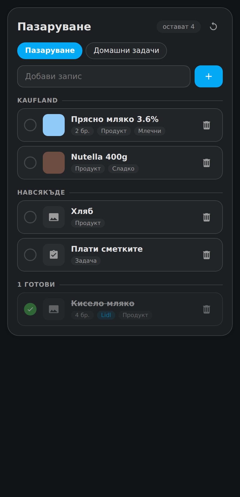

# HomeBasket Lists

Shopping lists for Home Assistant that stay in step with the built-in to-do
lists, and know what HomeBasket knows about each product.

<p></p>

The lists live in this integration, not as Home Assistant to-do entities, so
they can hold what a to-do item cannot: a shop, a quantity, a type, a link to a
HomeBasket product. They are still spoken to like the built-in lists, and they
still stay in step with them.

Each list gets one entity, `sensor.<list>_open_items`, counting what is left —
handy for badges and zone automations. The lists can also remind you at the
shop by themselves, read themselves out to a voice assistant, and carry a photo
of anything HomeBasket has no picture for.

## Languages

**Bulgarian and English.** The integration's own interface, the dashboard card,
the Assist phrases and the answers spoken back all exist in both, and follow the
language of the person using them — the card takes Home Assistant's language
unless its `language` option says otherwise, and a voice answer comes back in
the language it was asked in. Anything else falls back to English.

The examples below are in English; every one of them has a Bulgarian
counterpart, written into `custom_sentences/bg/` next to the English ones.

## Installation

### HACS (custom repository)

1. HACS → ⋮ → **Custom repositories**
2. URL `https://github.com/ivan1mihaylov/HomeBasket-Lists`, type **Integration**
3. Install, then restart Home Assistant
4. **Settings → Devices & Services → Add Integration → HomeBasket Lists**

The dashboard card comes with the integration — there is no second download and
no Lovelace resource to add. Add it to a dashboard with **Add card → HomeBasket
Lists**.

### Manual

Copy `custom_components/homebasket_lists` into `config/custom_components/` and
restart Home Assistant.

## Lists

One config entry is one list, so **Add entry** on the integration creates
another. Each list has:

| Setting | Meaning |
| --- | --- |
| **Keep in sync with** | Built-in to-do lists this one mirrors, in both directions. Any number of them. |
| **Shops** | Zones that count as shops. An item can be assigned one. |
| **Kinds of item** | Which kinds this list allows: groceries, products, tasks. All three lets each item decide; one makes the whole list that kind. |
| **Something that is already on the list** | Add to its quantity (default), keep the one that is there, or add a second line. |
| **Recognise HomeBasket products** | Match item names against HomeBasket, so the card can show pictures and categories. |
| **Remind me at the shop** | Notify the phone that reported the arrival when someone reaches one of the shops. |
| **Who to follow** | The people or device trackers watched for arrivals. Empty means everyone in the house. |
| **Stay in the shop for** | Minutes before the reminder is sent, so driving past says nothing. |
| **Then stay quiet for** | Minutes before the same shop may remind the same person again. |
| **Include items with no shop** | Put what can be bought anywhere on every shop's reminder. |
| **Notify service to fall back on** | Used when the arriving device has no app of its own. |

### The three kinds

An item is a **grocery**, a **product** or a **task** — or none of those, a
plain line with a name and a note. Groceries and products are both bought, so
both are counted, both take a shop and both answer *what do I need to buy*.
What each carries afterwards is what tells them apart:

| Kind | What it has |
| --- | --- |
| **Grocery** | Quantity and unit, shop, **best before** — shown on the item's row as it gets close |
| **Product** | Quantity and unit, shop, **link** to where it comes from |
| **Task** | Deadline, how long it takes, the tools it needs |

A scan picks the kind by itself: HomeBasket knows which database knew the
barcode — Open Food Facts, Open Beauty Facts, Open Pet Food Facts or Open
Products Facts — and the item lands as the right kind. A list buys two kinds
where HomeBasket knows four, so what the cat eats is a grocery and a shampoo is
a product. An item added by name that matches a product HomeBasket knows is
typed the same way.

A list set to **Tasks** only turns everything that lands on it into a task, and
one set to **Groceries** only into a grocery — whether it came from the card, an
action, a voice assistant or a linked to-do list. Allowing two of the three is
just as good: a shopping list that takes groceries and products turns a task
into a grocery and leaves the rest alone. Changing the setting converts what is
already on the list, and a list fixed to one kind stops showing the kind field,
since there is nothing left to choose.

Lists made before this existed are brought over on the first start: what was a
"product" becomes a grocery, and a list that took products takes both. Anything
that was not food is two taps to put right.

## How the sync works

Our list is the hub, the linked lists are spokes:

```
add in a spoke      →  the hub, then every other spoke
tick in a spoke     →  the hub, then every other spoke
delete in a spoke   →  gone everywhere
anything in the hub →  every spoke
```

Items are matched **by name**, because the same item has a different uid in
every list. Two consequences worth knowing:

- A rename looks like a delete plus an add. Renames are picked up on the
  five-minute reconcile rather than instantly, since a to-do entity's state
  does not change when an item is only renamed.
- Two items with the same name on one list are treated as one.

The first sync adopts whatever the linked lists already contain and **leaves
the shop empty** — a shop is something you assign afterwards, in the card.

`homebasket_lists.sync_now` runs a pass immediately.

## HomeBasket products

When [HomeBasket](https://github.com/ivan1mihaylov/HomeBasket) is installed,
typing in the add field offers the products it knows, matched on name, brand or
category. Pick one and the item lands on the list already linked to it, with its
picture, category and details — no waiting for a name to match. Arrow keys walk
the list, Enter takes the highlighted one, and Enter with nothing highlighted
adds exactly what you typed.

An item typed out by hand, or arriving from a linked list, is linked to a
product only when the name matches one **exactly**. A near match would attach
the wrong nutrition to the wrong item, and the suggestions are there for
everything else.

HomeBasket can also put its scans straight onto one of these lists instead of
onto a to-do entity — the list is chosen in **HomeBasket's** settings.

### Something that is already on the list

Scanning the same product twice means two of it: the item's quantity goes up by
one rather than the line being repeated. That is the default, and it applies
wherever the item comes from — a scan, the card, an action or a voice
assistant. The list's **Something that is already on the list** setting changes
it to keeping the one that is there, or to writing a second line.

A task has no quantity to raise, so counting keeps the task that is already on
the list; only *add a second line* ever writes it twice.

Neither integration needs the other. Without HomeBasket, items simply carry no
product and there are no suggestions; without these lists, HomeBasket keeps
using its to-do entity.

## Photos

Every item can carry a photo of its own — a task, a loose vegetable, a part from
the hardware shop, or something HomeBasket already has a picture for. Open the
item and use the square at the top to take one with the phone's camera or pick
one from the gallery; it shows on the item's row from then on. Nothing is
written until **Save**, and the × on the picture removes it.

Tapping a picture on the list itself shows it over the whole screen; tapping it
again — or Escape — puts it away.

Photos are shrunk before they are sent, kept in Home Assistant's own storage
(`.storage/homebasket_lists_images/<list>/`) and read back over the
authenticated WebSocket API, so they are never served from a public path the
way files in `www/` are. Deleting an item deletes its photo, and so does
deleting the list.

An item linked to a HomeBasket product starts with that product's picture in the
square, marked as coming from HomeBasket. Tapping it takes your own, which then
wins on the row; the × only ever removes your own — the product's picture
belongs to the product, where every list can use it.

## Shops and reminders

A shop is a zone. Assign one to an item and it belongs to that shop; leave it
empty and the item can be bought anywhere.

### Being reminded at the shop

Turn **Remind me at the shop** on and the list does it by itself. When a
watched person reaches one of its shops and stays there for the configured
time, the phone that reported the arrival gets a notification with what is
still open for that shop — plus everything with no shop, since that can be
bought anywhere. Leaving before the time is up cancels it, so driving past a
shop says nothing, and each shop stays quiet for the cooldown afterwards.

The phone is found from the person's `source` tracker and its device, which is
the `notify.mobile_app_*` service of the app that reported the arrival. When
there is no such service the fallback setting is used, and when that is empty
too the reminder is left in the notifications panel.

Every reminder also fires `homebasket_lists_arrival`, with the list, the zone,
who arrived and what is open, so an automation can do something else with it.

### Doing it yourself

`homebasket_lists.get_items` with a `store` returns what to buy there —
**including the items with no shop**, since those can be bought anywhere:

```yaml
automation:
  - triggers:
      - trigger: zone
        entity_id: person.ivan
        zone: zone.kaufland
        event: enter
    actions:
      - action: homebasket_lists.get_items
        data:
          list: Shopping
          store: zone.kaufland
          status: needs_action
        response_variable: shopping
      - condition: template
        value_template: "{{ shopping.count > 0 }}"
      - action: notify.mobile_app_phone
        data:
          title: Kaufland
          message: >-
            {{ shopping['items'] | map(attribute='summary') | join(', ') }}
```

## Voice

The lists are not to-do entities, so the built-in list phrases cannot reach
them. The integration registers intents of its own instead, and writes the
sentences for them into `custom_sentences/bg/` and `custom_sentences/en/`, which
is where Assist looks for phrases a custom integration adds.

| You say | What happens |
| --- | --- |
| *add milk to Shopping* | The item is added, and linked to a HomeBasket product when the name matches. |
| *I bought milk* | Ticked off on whichever list still has it, here and in every linked list. |
| *mark milk as done* | The same, said the other way. |
| *what is on Shopping* | Assist reads out what is left. |
| *what do I need to buy* | The products still open, grouped by the shop to buy them in, each with its quantity. |
| *what do I have to do* | The tasks still open, each with how long it takes. |
| *what are my tasks on Repairs* | The same, for one list. |

The last two answer for every list at once when no list is named, and say which
list each thing is on. They ask about kinds, so *what do I need to buy* returns
the products and *what do I have to do* the tasks — an item with no kind is
neither, and is only read out by *what is on &lt;list&gt;*.

Quantities are said rather than read out: an item written *eggs, 5 pcs* is
spoken as *eggs - 5 pieces*, and kg, g, l and ml are said in full too. A unit
the answer's language does not know is said exactly as it was typed.

Each line has several wordings: *what do I need to buy*, *what should I buy*,
*what is left to buy*, *what is on my shopping list* and *what do I need from
the shop* all ask the same thing, and so do *check off*, *tick off*, *complete*,
*I bought* and *I finished*. Bulgarian has the same spread. The full set is in
`intent.py`, and every one of the 800-odd wordings is checked against the
matcher Assist uses.

The list name can be left out when there is only one list. The files are
rewritten when a list is added or renamed, and are left alone when nothing
changed — so edits of your own survive until the names change. **Restart Home
Assistant, or reload Assist, after adding a list**, since sentences are read at
startup.

## Actions

| Action | What it does |
| --- | --- |
| `homebasket_lists.add_item` | Add an item with kind, shop, quantity, note, best before or link. |
| `homebasket_lists.update_item` | Change an item. Only the fields you pass are touched. |
| `homebasket_lists.remove_item` | Delete it here and in every linked list. |
| `homebasket_lists.get_items` | Read items, filtered by shop, type or status. |
| `homebasket_lists.sync_now` | Run a sync pass now. |

Every action takes a `list` — the list's name. Leave it out when there is only
one list, or, where it makes sense, to act on all of them.

## Using it from another integration

```python
api = hass.data.get("homebasket_lists_api")
for board in api.lists:
    print(board["name"], len(board["items"]))

to_buy = api.items_for_store("zone.kaufland")

# Put something on a list, or add one more of it if it is already there.
result = await api.async_add_item("Milk", quantity=1, unit="pcs")
if result and result["increased"]:
    print(result["list"], "now has", result["item"]["quantity"])
```

`async_add_item` takes `entry_id` or `name` to say which list; with neither, the
only list there is. It returns None when that is not clear enough to act on, so
a caller can fall back to whatever it did before.

Listen for `homebasket_lists_updated` to know when something changed.

## The card

```yaml
type: custom:homebasket-lists-card
```

| Option | Default | Description |
| --- | --- | --- |
| `title` | the list's name | Card heading. |
| `list` | all | One list, picked from those that exist. Empty shows a tab per list. |
| `language` | Home Assistant's | `bg` or `en`. Leave empty to follow Home Assistant. |
| `group_by_store` | `true` | Group open items under their shop. |
| `show_completed` | `true` | Show what is already ticked off. |

## Development

The parts that are hard to try by hand have tests that run without Home
Assistant:

```bash
python3 tests/test_sync.py      # the two-way sync
python3 tests/test_stores.py    # guessing a shop from Open Food Facts
python3 tests/test_arrivals.py  # shop reminders and fixed item kinds
python3 tests/test_sentences.py # the Assist phrases, parsed with hassil
python3 tests/test_voice.py     # what the assistant says back
python3 tests/test_photos.py    # the photos an item can carry
```

The sync test stands a fake to-do list up and walks an item through adding,
ticking and deleting from both sides; the arrivals test walks someone into a
shop, out of it again and back in; the sentences test expands every wording of
every phrase and checks each one comes back as the intent it was written for;
the photo test writes real files in a temporary folder.

## License

[MIT](LICENSE)
